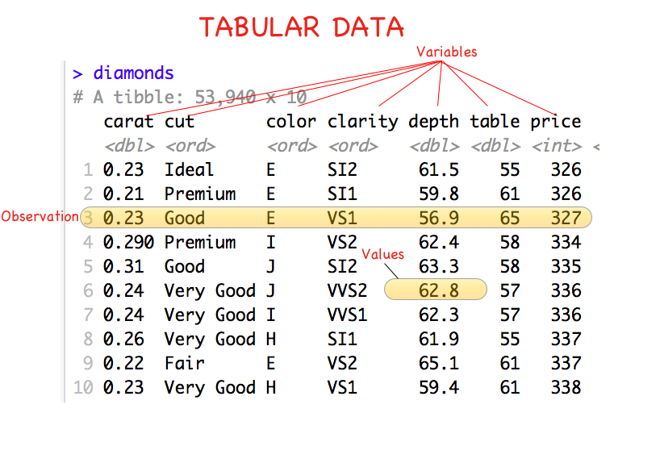
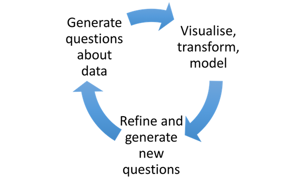

```{r setup, include=FALSE}
knitr::opts_chunk$set(echo = TRUE,message=FALSE,warning=FALSE, cache=TRUE)
```


```{r packages, echo=FALSE, message=FALSE, warning=FALSE}
library(tidyverse)
library(fueleconomy)
```


# Review from Last Time

1. Compare and contrast `mutate()` and `summarise()`?

--

2. What do the commands `count()` and `tally()` do? How are they related to `summarise()`?

--

3. What does the `group_by()` command do?


---

# Characteristics of Data Sets



---

# EDA Cycle 




.footnote[Source: R4DS]

---

#  Two Key Goals

Understand: 

* Variation within variables
    + Center, spread, shape, unusual observations
    + Overall and within groups

--

* Covariation among variables
    + Form, direction, and strength of relationships

---

# Graphical Methods for Exploring Variation

* Categorical variables
    + Bar charts `geom_bar()` and `geom_col()`
    
--
    
* Continuous variables
    + Histograms: `geom_histogram()`
    + Frequency polygons: `geom_poly()`
    
---

# Exploring the Vehicles Data with Bar Charts

```{r, fig.height = 4}
ggplot(vehicles) + 
  geom_bar(aes(x = make))
```

* Consider only the common makes?

---

#  Use the common makes data

```{r, fig.height = 5, message=FALSE}
cardata <- left_join(common, vehicles)
ggplot(cardata) + 
  geom_bar(aes(x = make)) +
  theme(axis.text.x = element_text(angle = 90, hjust = 1))
```

---

#  Reorder bars and graph proportions

* The code to pre-process to get the names in order:

```{r}
ordered_carnames <- cardata %>% 
  count(make, sort = TRUE) %>%
  pull(make)
ordered_carnames
```
---

# The Resulting Graph

```{r, fig.height = 5}
ggplot(cardata) + 
  geom_bar(aes(x = make, y = ..prop.., group = 1)) +
  theme(axis.text.x=element_text(angle=90, hjust=1)) + 
  scale_x_discrete(limits = ordered_carnames) + 
  labs(x = "Car Makes", y = "Proportion of All\n  Models Tested")
```

---

# Frequency table of makes with the most models tested

```{r}
cardata %>% 
  count(make, sort = TRUE)
```

---

##  Exploring Variability with Histograms
### The `diamonds` data

```{r, fig.height = 4}
ggplot(data = diamonds) + 
  geom_histogram(aes(x = carat))
```

---

##  Exploring Variability with Histograms
###  Considerations

* Height represents count for corresponding interval

* Interpret center, spread, shape, unusual observations

* Modify the binwidth to generate more hypotheses

---

class: inverse, center, middle

# Shiny Apps on RStudio


### Diamond data

###  Old Faithful eruption times

---

# Histograms with Proportions

To show the  proportions (relative frequency) in each inerval, try the following:

```{r, message = FALSE, fig.height = 4}
ggplot(data = diamonds) + 
  geom_histogram(aes(x = carat, y = stat(count / sum(count))))
```

---

# Frequency Polygons: `geom_freqpoly()`

* An alternative to histograms that is especially useful for comparing groups

* Replace bars with lines whose vertices represent the count for the corresponding interval

---

# Diamonds data frequency polygon  

```{r, message = FALSE, fig.height = 4}
ggplot(data = diamonds) + 
  geom_freqpoly(aes(x = carat))
```

---

## Frequency polygon with subgroups 
### Diamonds Data

```{r, message = FALSE, fig.height = 4}
ggplot(data = diamonds) + 
  geom_freqpoly(aes(x = carat, color = clarity))
```

**Note:** Heights are NOT additive

---

# Missing data

* Use `is.na()` to check for NA values

* Avoid simply omitting cases with missing/NA values

* Use EDA to compare cases with missing vs non-missing data.


