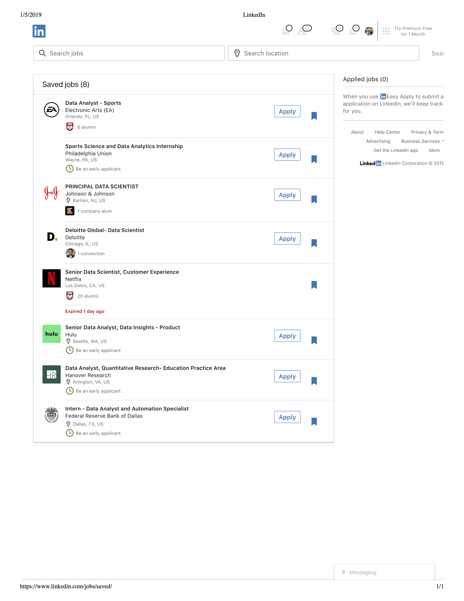

```{r setup, include=FALSE}
knitr::opts_chunk$set(echo = TRUE,message=FALSE,warning=FALSE)
```


```{r, echo=F,message=FALSE}
library(tidyverse)
```

# What is Data Science? 

## A Picture is Worth 1000 Words


```{r, out.width='100%', fig.align='center', fig.cap='',echo=FALSE}
knitr::include_graphics('figs/Intro_to_Math295/r4ds_diagram.png')
```

---

## What you will learn about in this class

* Importing data
--

* Wrangling data  
    - Tidying
--
    - Transforming
--

* Visualization
--

* Modeling
--

* Communication
    - Reproducible documents using R Markdown   
--

* ...and some R programming  
---
# New Slide from Macbook Pro

* This is just nonsense code that will need deleting

```{r}
x <- rnorm(1000)
hist(x)
```

---
class: center, middle
background-image: url(figs/Intro_to_Math295/r4ds_diagram_overlay.png)
background-size: contain

???
* Programming skills you may or may not have seen before such as creating new functions, working with vectors and arrays, and using loops and conditionals will be helpful in most of the steps of a serious data science project.   
* Once we get into the course a bit, we'll spend a few classes focusing on these techniques.

---
class: center, middle
background-image: url(figs/Intro_to_Math295/data_wrangler.png)
background-size: contain

???

By the end of this class, you should be a data wrangler.


---
# R and RStudio 

 is the statistical programming language.


--


 is the IDE (Integrated Development Environment). 

--

.center[]

Source: moderndive.com


---

# And a little help from their friends  


* Many fall under the umbrella of the 

.center[]


???

* R is the enginge, RStudio is the car body  
* Packages are customizations  

---

# What you will not learn in this class

> - Python and other languages      
> - Techniques for Big Data  
> - Machine Learning  
> - Statistical inference  

???

* Focus on use of R; might not always be the best tool available, but this approach will let us go deep rather than flitting from one language to another. R allows for "tailored grammars" for the data science processes.
* Why no big data? Develop tools that can be applied to bigger problems.   
* Machine learning? It's a different course, one that Prof Erdi has taught.  
* Stat inference: no emphasis on hypothesis testing. Two areas of statistics: Descriptive Statistics and Inferential Statistics.  
    - Mention 80/20 rule for stats anaylses

---

# What you also will not learn in this class  


* Base graphics in R (only used a little here)

* The **mosaic** package

* **ggformula** syntax for graphics (as used in MATH 260)

???

Especially relevant for those who have taken other courses with me.
---


# [EDIT THIS A LITTLE MORE] Getting your hands dirty  

## Join  RStudio Cloud


* Go to the RStudio Group [link](https://rstudio.cloud/spaces/7916/join?access_code=i2qDCBORDh%2FQOLWyFlTSxVaAkNH2onwLLmMB4MvH) or go to http://bit.ly/2LQANFV in your browser.  
    - Creating a new account should add you to the class.   
    
>  Once you've finished, place a green sticky note on your laptop.  If you have questions let me know.  

---


# UN Voting Visualization 

You don't need to know R yet to create your first data visualization!   

- Log on to RStudio Cloud and click on this course's workspace.  
- Make a copy of the project **Day 1 Visualisation** for this investigation and launch it.  
- In the **Files** pane in the bottom right corner, find the file called `day1_viz.Rmd`. Open it, and then click on the "Knit" button.  Peruse the output (the `html` file).   
- Go back to the `day1_viz.Rmd` file and put your name on top (in the `yaml` -- we'll talk about what this means later) and knit again.  
- Then, change the country names to those you're interested in. Your spelling and capitalization must match how the countries appear in the data, so take a peek at the Appendix to confirm spelling.  
- Knit again and  you've finished your first data visualization!  

> Once you've finished, place a green sticky note on your laptop.  If you have questions let me know.  

---

# Jobs in Data Science  

## Data Scientist Jobs 

> Data Scientist tops Money Magazine's [list](http://time.com/money/5114734/the-50-best-jobs-in-america-and-how-much-they-pay/) of the 50 best jobs in America

## Data Scientist Jobs   

.center[]
```

???

Link to Linked In page:  

https://www.linkedin.com/jobs/saved/


