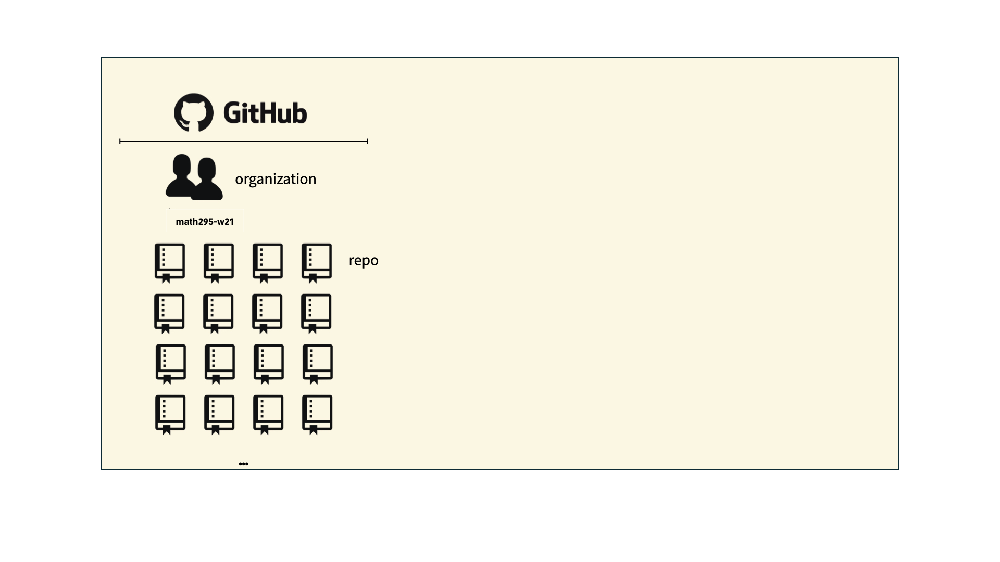
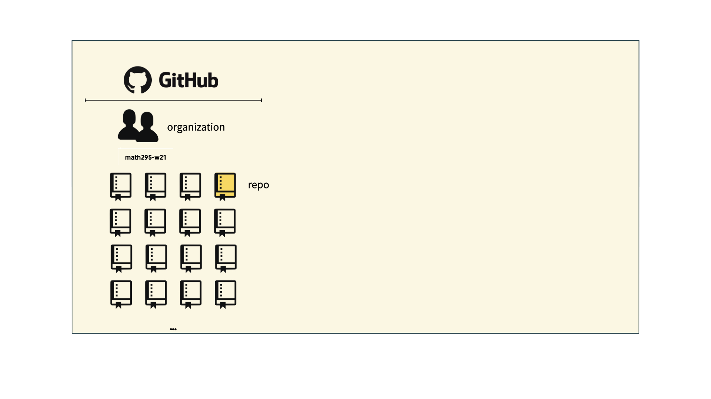
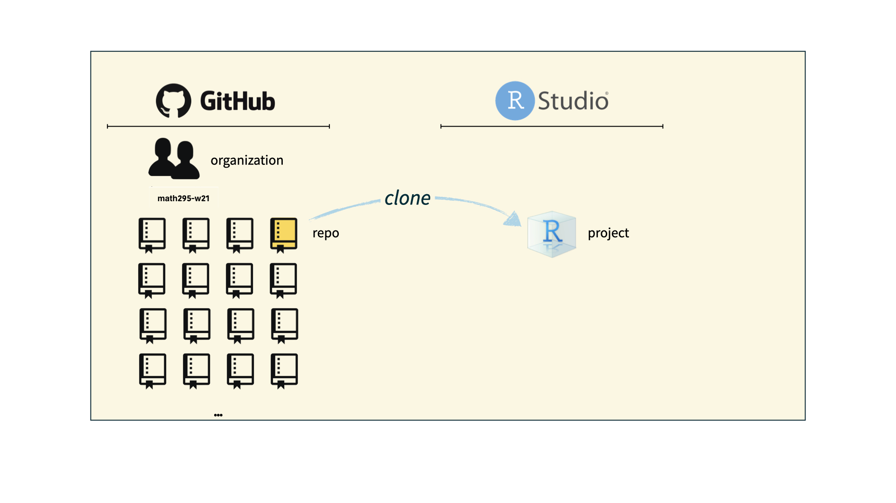

```{r setup, include=FALSE}
knitr::opts_chunk$set(echo = TRUE,message=FALSE,warning=FALSE)
```


```{r, echo=F,message=FALSE}
library(tidyverse)
```

# What is Data Science? 

## A Picture is Worth 1000 Words


```{r, out.width='100%', fig.align='center', fig.cap='',echo=FALSE}
knitr::include_graphics('figs/Intro_to_Math295/r4ds_diagram.png')
```
---


## What you will learn about in this class

* Importing data
--

* Wrangling data  
    - Tidying
--
    - Transforming
--

* Visualization (using **ggplot2**)
--

* Modeling
--

* Communication
    - Reproducible project sharing using GitHub   
    - Reproducible documents using R Markdown reports
--

* ...and some R programming  
---

class: center, middle
background-image: url(figs/Intro_to_Math295/r4ds_diagram_overlay.png)
background-size: contain

???
* Programming skills you may or may not have seen before such as creating new functions, working with vectors and arrays, and using loops and conditionals will be helpful in most of the steps of a serious data science project.   
* Once we get into the course a bit, we'll spend a few classes focusing on these techniques.

---
class: center, middle
background-image: url(figs/Intro_to_Math295/data_wrangler.png)
background-size: contain

???

By the end of this class, you should be a data wrangler.


---
# R and RStudio 

 is the statistical programming language.


--


 is the IDE (Integrated Development Environment). 

--

.center[]

Source: moderndive.com


---

# And a little help from their friends  


* Many fall under the umbrella of the 

.center[]


???

* R is the enginge, RStudio is the car body  
* Packages are customizations  

---

# What you will not learn in this class

> - Python and other languages      
> - Techniques for Big Data  
> - Machine Learning  
> - Statistical inference (confidence intervals and tests of significance) 

???

* Focus on use of R; might not always be the best tool available, but this approach will let us go deep rather than flitting from one language to another. R allows for "tailored grammars" for the data science processes.
* Why no big data? Develop tools that can be applied to bigger problems.   
* Machine learning? It's a different course, one that Prof Erdi has taught.  
* Stat inference: no emphasis on hypothesis testing. Two areas of statistics: Descriptive Statistics and Inferential Statistics.  
    - Mention 80/20 rule for stats anaylses

---

# What you also will not learn in this class  


* Base graphics in R (only used a little here)

* The **mosaic** package

* **ggformula** syntax for graphics (as used in MATH 260)

???

Especially relevant for those who have taken other courses with me.


---
class: inverse, center, middle

# Version Control and Collaboration

---
## You already know a little about version control if you've used ...

- Google drive

- Dropbox

- Microsoft Word with Track Changes

- Other services with "version history"


---

# Git and GitHub

.pull-left[
```{r echo=FALSE, out.width="25%"}
knitr::include_graphics("img/git-logo.png")
```
- Git is a version control system -- like “Track Changes” features from Microsoft Word, on steroids

- It's not the only version control system, but it's a very popular one

- Was created by Linus Torvalds in 2005
]
.pull-right[
```{r echo=FALSE, out.width="25%"}
knitr::include_graphics("img/GitHub_Logo.png")
```
- GitHub is the home for your Git-based projects on the internet -- like Dropbox but much, much better

- We will use GitHub as a platform for submitting homework and collaboration on projects
]

---
class: top, center
background-image: url("https://blog.devmountain.com/hs-fs/hubfs/Imported_Blog_Media/Gitvs_Github-1a-1.jpg?width=1200&name=Gitvs_Github-1a-1.jpg")
background-size: 80%

.left[.footnote[Source: https://blog.devmountain.com/git-vs-github-whats-the-difference/]]

---

## Versioning

```{r echo=FALSE, fig.align = "center", out.width = "70%"}
knitr::include_graphics("img/lego-steps.png")
```

Source: [Data Science in a Box](https://datasciencebox.org/)
???

Note that in a real construction project, progress is not so linear. There may be work going on in several parts of the building.
---

## Versioning
### with human readable commit messages

```{r echo=FALSE, fig.align = "center", out.width = "60%"}
knitr::include_graphics("img/lego-steps-commit-messages.png")
```

???


---

## Why do we need version control?

```{r echo=FALSE, fig.align = "center", out.width="25%"}
knitr::include_graphics("img/phd_comics_vc.gif")
```

* Document project
* Facilitate team collaboration
* Share work


---

## How will we use Git and GitHub?

```{r echo=FALSE, out.width="100%"}

```

---

## How will we use Git and GitHub?

```{r echo=FALSE, out.width="100%"}

```

---

## How will we use Git and GitHub?

```{r echo=FALSE, out.width="100%"}

```

---

## How will we use Git and GitHub?

```{r echo=FALSE, out.width="100%"}
knitr::include_graphics("img/m295whole-game-04.png")
```

---

# Git and GitHub tips

- Becoming Git masters is beyond the scope of the course.

- Using the RStudio server to interface with GitHub will allow us to focus on just a few commands and avoid command line complications.

--
- For much more on working with git and R, consult  [happygitwithr.com](http://happygitwithr.com/). 

---

## In-Class Activity

* Creating your first repository

* Your first commit

* Finding your way around on the GitHub site


<br>

*Next time...*

*We get RStudio and GitHub to exchange credentials...*


