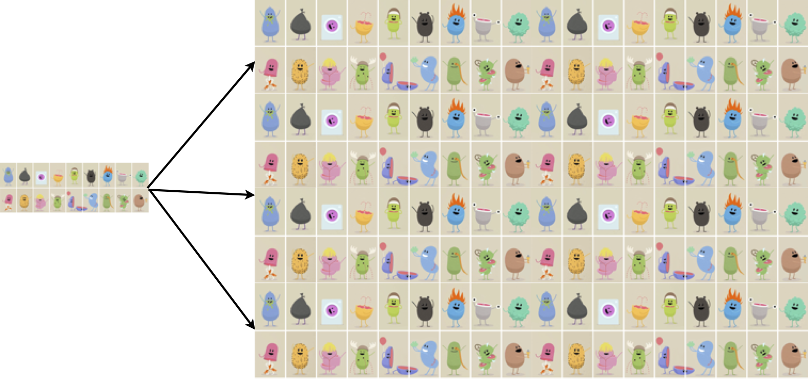
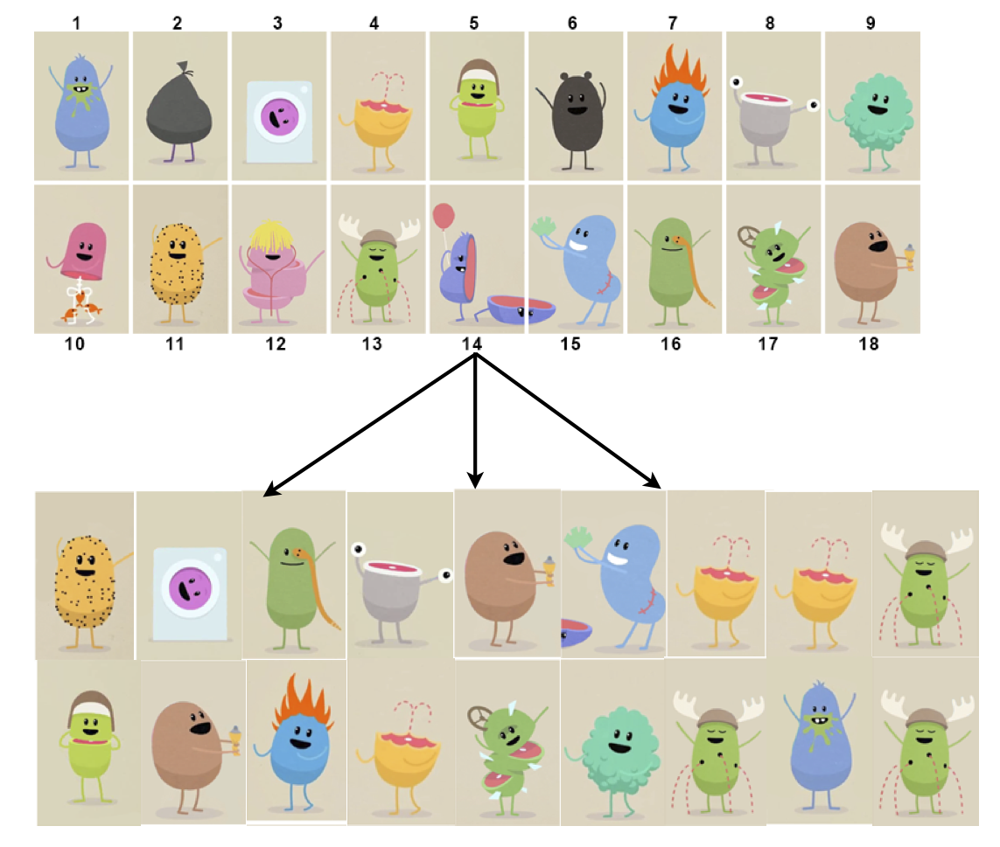

```{r setup, include=FALSE}
knitr::opts_chunk$set(echo = TRUE,message=FALSE,warning=FALSE)
```


```{r, echo=F,message=FALSE}
library(mosaic)
library(Lock5withR)
```

# 3.3 Constructing Bootstrap Confidence Intervals

## Review from Last Time

To create a 95% confidence interval for a parameter:

1. Take many random samples from the population.  

2. Compute the sample statistic for each sample.  

3. Compute the standard error (SE) as the standard deviation of these statistics.  

4. Compute the interval $\text{statistic}\pm 2\cdot\text{SE}$   

**But there's one small problem...**

---

# Reality

* In reality, **we only have one sample!**  

* How do we know how much sample statistics vary, if we only have one sample?!?  

$\Rightarrow$ Use the **bootstrap!!**  

---

# Bootstrap?


---

# Population


We don't observe the population so imagine the population is many copies of the **original sample**  

## Original Sample


---

# Population

```{r, out.width = "700px",echo=FALSE}

```

---

# Sampling With Replacement

* To simulate a sampling distribution, we can just take repeated random samples from this "population" made up of infinitely many copies of the sample but...
--

* In reality, we can’t make infinite copies of the sample...  

--

* Sample repeatedly **with replacement**
  + Each case can be selected more than once.  

--

**Note:** This is reasonable because a good **random sample** is our buest guess at what the population looks like.  

---

# Bootstrap Sample  

* Sample **with** replacement from the **original sample**, using the **same sample size**  

```{r, out.width = "500px",echo=FALSE}

```

---

# Bootstrap  

* A **bootstrap sample** is a random sample taken with replacement from the original sample, of the same size as the original sample.  

* A **bootstrap statistic** is the statistic computed on a bootstrap sample (mean, proportion, difference in means, etc.)  

* A **bootstrap distribution** is the distribution of many bootstrap statistics.  

---
background-image: url(figs/bsdiagram.jpg)
background-position: center
background-size: contain

---

# Golden Rule of Bootstrapping  

Bootstrap statistics are to the orginal sample statistic as the original sample statistic is to the population parameter.  

See figure [here](http://people.kzoo.edu/enordmoe/math260/Lock5_lect/chap3/figs/hesterberg_fig.pdf)

???
Talk through Hesterberg figure from text on page 

---

# Center  

* The **sampling distribution** of a statistic is centered around the corresponding population parameter but...  

* The **bootstrap distribution** is centered around the observed sample statistic  

* Luckily, we use the **bootstrap distribution** just to learn about **variability** (not the center)  

---

# Standard Error  

* The **variability** of the bootstrap statistics is similar to the variability of the sample statistics   

>Use the standard deviation of the bootstrap distribution to estimate the SE of the statistic!  

---

## What statistics can we bootstrap?  

* Mean $(\bar x)$  
* Proportion $(\hat p)$  
* Difference in Means $(\bar x_1-\bar x_2)$  
* Difference in Proportions $(\hat p_1-\hat p_2)$  
* Correlation $(r)$ 
* Regression slope $(b)$
* Standard deviation $(s)$
...

---

# Bootstrapping in a Nutshell

1. Generate samples with replacement  

2. Calculate sample statistic  

3. Repeat...  

$\Longrightarrow$ Use the bootstrap distribution to estimate the SE of the statistic

---

## A 95% Confidence Interval Using a Bootstrap Standard Error

> When a bootstrap distribution for a sample statistic is symmetric and bell-shaped, we estimate a 95% confidence interval using $$\text{Statistic}\pm 2\cdot \text{SE}$$ 
> where SE denotes the standard error of the statistic estimated from the bootstrap distribution.  

---

# Summary  

* To generate a bootstrap distribution, we:  
    1. Generate bootstrap samples by sampling with replacement from the original sample, using the same sample size  
    2. Compute the statistic of interest, a bootstrap statistic, for each of the bootstrap samples  
    3. Collect the statistics for many bootstrap samples to form a bootstrap distribution  
--
* If the bootstrap distribution is symmetric and bell-shaped, a 95% CI can be estimated by $\text{Statistic}\pm 2\cdot \text{SE}$ where SE can be estimated as the standard deviation of a bootstrap distribution.

---
class: center, middle, inverse


# 3.4 Bootstrap Confidence Intervals using Percentiles

---

# Outline

* Confidence intervals based on bootstrap percentiles  

* Different levels of confidence  

* Impact of sample size and level of confidence on interval width  

* Cautions for bootstrap intervals  

---

# Beyond 95%: The Percentile Method

> If the bootstrap distribution is **approximately symmetric**, we can construct a confidence interval by finding the **percentiles** in the bootstrap distribution so that the proportion of bootstrap statistics *between* the percentiles matches the *desired confidence level.*   

---

# The Percentile Method  


* For a P% confidence interval, keep the middle P% of bootstrap statistics.  


* For a 99% confidence interval, keep the middle 99%, leaving 0.5% in each tail.    
    + The 99% confidence interval would be 
$$
(0.5\text{th percentile}, 99.5\text{th percentile})
$$  

where the percentiles refer to the bootstrap distribution.

---

# Level of Confidence

* As confidence level **increases**, interval becomes **wider**  
    + Why? To catch more plausible values.  
    + A 99% confidence interval contains the middle 99% of the bootstrap distribution while a 90% interval would contain only the middle 90%.  

* As sample size ($n$) **increases**, interval becomes **narrower**  
    + Why? More precise estimate.  

---

# Two Approaches to a Bootstrap Confidence Interval

1. **Standard Error Method:** Estimate the SE of the statistic by computing the standard deviation of the bootstrap distribution, and then generate a 95% confidence interval by  

$$
\text{Statistic}\pm 2\cdot\text{SE}
$$

2. **Percentile Method:** Generate a P% confidence interval as the range for the middle P% of bootstrap statistics.  

---

# Two Methods

* Either the standard error method or the percentile method will give similar 95% confidence intervals.  

* If a level of confidence other than 95% is desired, use the percentile method.  
---
class: inverse

# Cautions

* These methods for creating a confidence interval only work if the bootstrap distribution is **smooth and symmetric**  

* **ALWAYS** look at a plot of the bootstrap distribution!  

* If the bootstrap distribution is **highly skewed** or looks **“spiky” with gaps**, you will need to go beyond intro stat to create a confidence interval.  
    + Example: Don't use bootstrap for the median or quartiles!  

---

# Number of Bootstrap Samples

* When using bootstrapping, you may get a slightly different confidence interval each time.  This is fine!  

* The more bootstrap samples you use, the more precise your answer will be.    

* For the purposes of this class, 1000 bootstrap samples is fine.    
    + In real life, you probably want to take 10,000 or even 100,000 bootstrap samples.  

---

# Summary

* 95% confidence intervals can be created using the **standard error** or the **percentiles** of a bootstrap distribution.  

* For any other desired level of confidence, the **percentile** method may be used.  

* A confidence interval from bootstrap percentiles can be created for any parameter, as long as the bootstrap distribution is approximately **smooth and symmetric**.  
